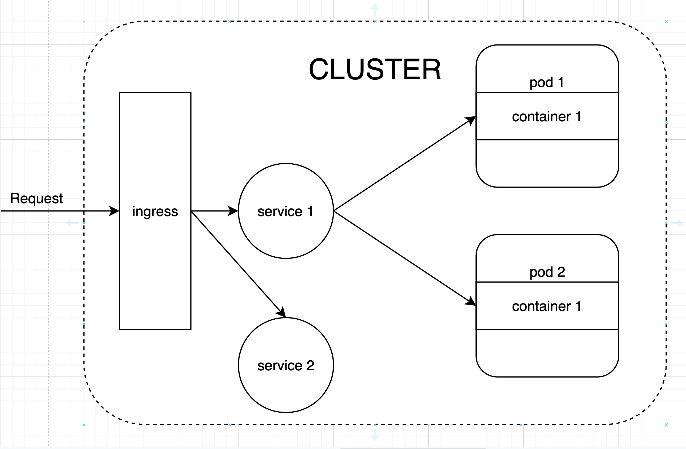

# Deploy the App

After you have containerized your app the next step is to write the deployment yamls that platforms like Kubernets and Openshift use.

There are 3 main components:



## Steps

```
$ kubectl apply -f yamls/
```

## Kubernetes Resources

### Deployment

This is given in `deployment.yaml`. It creates a K8s deployment resource.
Usually you will have one deployment yaml for every micro-service in your app.
One deployed the deployment will create a replica set.
The replica set will then create the number of pods you specify.
When those pods go down for any reason, the replica set will start new pods to replace them.
In our example we use `replicas: 2` to start 2 pods.

Each pod will run a container using the image that we specified.
The replica set is able to track the pods using a label that we applied to each pod
```yaml
labels:
    app: my-web-app
```

### Service

This is given in `service.yaml`. It creates a K8s service resource.
Each pod in a cluster has a unique IP address.
The service can be used to expose all these pods under a single IP address.
When requests are sent to the service's IP address, they get sent to the backend pods in a round-robin fashion.
Similar to the replica set, the service also uses labels to select the pods.

### Ingress

This is given in `ingress.yaml`. It creates a K8s ingress resource.
The ingress has a public IP address that can be accessed from outside the cluster.
It can be used to route requests to the service running inside the cluster.
